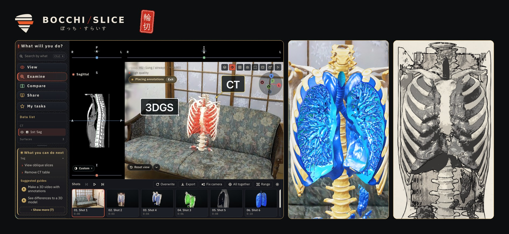

# BOCCHI/SLICE



**Browser-based 3D visualization — view, examine, compare and share.**
Drop CT/MR data (DICOM, NIfTI), 3D models (GLB, OBJ, STL, PLY) or 3D Gaussian Splats (PLY, SPZ) onto a single HTML file. Everything runs in the browser.

- **No install, no server** — open `bocchi-slice.html` in a browser.
- **Nothing leaves your machine** — all data is processed locally in the browser; the app makes no network requests.
- **Desktop and phone** — the same file works on both (latest Chrome, Edge, Safari or Firefox; WebGL2 required).

> For research and education only. Not for diagnosis or treatment decisions.

## Getting started

1. Download the latest `bocchi-slice.html` from [Releases](../../releases) and open it in a browser.
2. Drop a DICOM folder or a 3D model file onto the window (a built-in sample CT is available too).
3. Pick **View / Examine / Compare / Share** in the left column, or type what you want to do into the search box (Ctrl+K). The app then guides you through the steps on screen.

### On a phone (works offline)

Open the hosted app (GitHub Pages: `https://<user>.github.io/<repo>/`) in Safari or Chrome and choose **Add to Home Screen**. It starts full-screen from its own icon, and after the first visit it opens without a connection. The page only refreshes itself from the same site when online; your data still never leaves the device.

To publish it: Settings → Pages → *Deploy from a branch* → `main` / root.

The in-app **Help** (top right) and the `?` shortcut list are the reference for what the app can do. Features change between versions, so this README intentionally stays short and defers to the in-app help.

## Formats

| Input | Output |
|---|---|
| DICOM (CT/MR, including JPEG / JPEG-LS / JPEG 2000 compressed), NIfTI | Images (PNG), video (MP4 / WebM / GIF) |
| GLB / glTF, FBX, OBJ, STL, PLY, 3DGS (PLY / SPZ) | GLB / glTF, OBJ, STL, PLY, FBX |
| DICOM-SEG, RTSTRUCT, NIfTI label maps | DICOM-SEG, RTSTRUCT, NIfTI label maps, CSV (measurements) |
| Project (.zip / self-contained HTML) | Project (.zip / self-contained HTML), turntable HTML, VR HTML |

## Saving and privacy

- Projects are saved as `.zip` (optionally including the CT data) or as a **self-contained HTML** that recipients open in a browser; a password can be set.
- Saved files contain no patient identifiers (name, ID, …). The browser-side autosave (IndexedDB) is readable only on the same machine and browser.
- No network access. The UI fonts (IBM Plex Sans JP / IBM Plex Mono) are embedded. Optional annotation typefaces are fetched from Google Fonts only if you switch that on in Settings (off by default).

## Languages

Japanese, English, German, Korean, Simplified Chinese, Traditional Chinese. The language follows the browser setting and can be changed on the start screen or in Settings.

## Development

The source is a single HTML file; there is no build step.

```
bocchi-slice.html        # the app (this is all you need)
index.html               # redirects to the app (GitHub Pages entry)
manifest.webmanifest     # home-screen app settings
sw.js                    # offline cache for the hosted app
icon-*.png, apple-touch-icon.png
CHANGELOG.md
LICENSE, NOTICE, THIRD_PARTY_NOTICES.md
docs/hero.jpg
```

Bug reports and feature requests go to [Issues](../../issues). Please do not attach medical data; say whether the problem reproduces with the built-in sample CT.

## License

Apache License 2.0 (see [LICENSE](LICENSE) and [NOTICE](NOTICE)). Copyright 2026 Haruki Fukuda.
Bundled third-party code (OpenJPEG, CharLS, cornerstone codecs, Emscripten runtime, fzstd) and embedded fonts are listed in [THIRD_PARTY_NOTICES.md](THIRD_PARTY_NOTICES.md) and under Settings → Licenses in the app.

## Developer

Haruki Fukuda — bocchislice@gmail.com

---

### 日本語

**BOCCHI/SLICE** は、ブラウザだけで動く3Dビジュアライゼーションです。CT・MRI（DICOM / NIfTI）、3Dモデル（GLB / OBJ / STL / PLY）、3DGS（PLY / SPZ）を1つのHTMLファイルにドロップするだけで、見る・調べる・比べる・伝えるができます。インストール不要、データは外に送りません。PCでもスマホでも動きます。
[Releases](../../releases) から `bocchi-slice.html` をダウンロードして開いてください。機能の詳細はアプリ内の Help（右上）にあります。
スマホでは、公開したページ（GitHub Pages）をSafari・Chromeで開いて「ホーム画面に追加」すると、アイコンから全画面で起動し、2回目からは電波がなくても開けます。
研究・教育用のソフトウェアです。診断や治療の判断には使えません。
開発者：Haruki Fukuda（bocchislice@gmail.com）／ライセンス：Apache License 2.0
